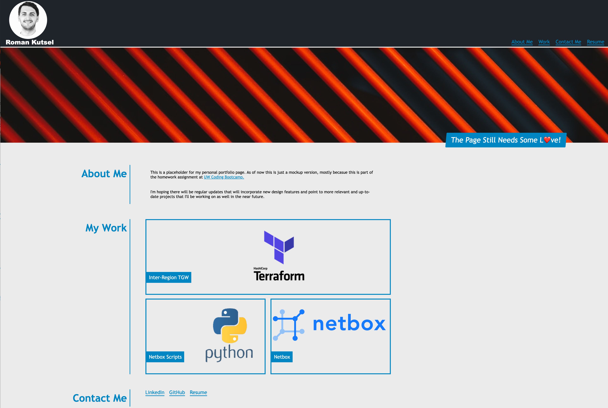
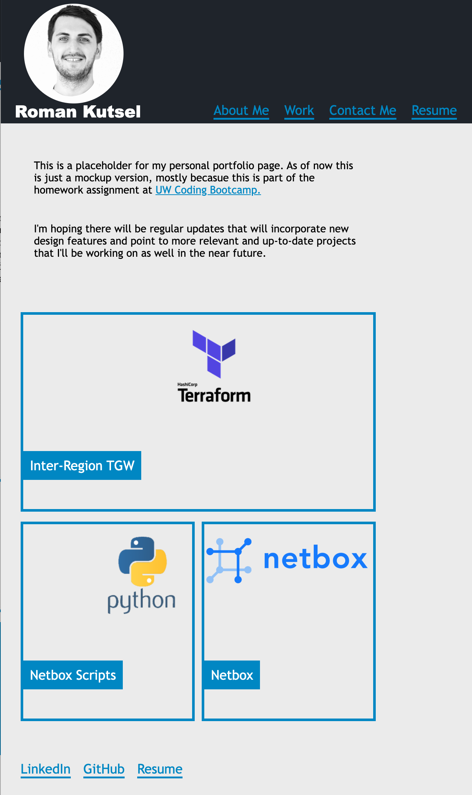

# Homework Week II Personal Portfolio Mockup Page

## Description

Placeholder for the personal web page portfolio homework assignment. My approach was to mimic the look of the actual mockup page we got in the assignment. The end result looks very close to the original page with some slightly different touches that were added based on the user story and the acceptance criteria. Additionally included links to guides/articles that helped with the assignment. 

## User Story

```
AS AN employer
I WANT to view a potential employee's deployed portfolio of work samples
SO THAT I can review samples of their work and assess whether they're a good candidate for an open position
```


## Acceptance Criteria

Here are the critical requirements necessary to develop a portfolio that satisfies a typical hiring manager’s needs:

```
GIVEN I need to sample a potential employee's previous work
WHEN I load their portfolio
THEN I am presented with the developer's name, a recent photo or avatar, and links to sections about them, their work, and how to contact them
WHEN I click one of the links in the navigation
THEN the UI scrolls to the corresponding section
WHEN I click on the link to the section about their work
THEN the UI scrolls to a section with titled images of the developer's applications
WHEN I am presented with the developer's first application
THEN that application's image should be larger in size than the others
WHEN I click on the images of the applications
THEN I am taken to that deployed application
WHEN I resize the page or view the site on various screens and devices
THEN I am presented with a responsive layout that adapts to my viewport
```

## My Own Mock-Up Desktop



## My Own Mock-Up Mobile



## Original Mock-Up

The following animation shows the web application's appearance and functionality:


## Helful Links

<ul>
<li style="list-style-type: '\1F44D'; // thumbs up sign"><a href="https://www.w3schools.com/cssref/css_selectors.asp">CSS Selectors</a></li>
<li style="list-style-type: '\1F44D'; // thumbs up sign"><a href="https://css-tricks.com/css-grid-replace-flexbox/">Grid vs Flexbox</a></li>
  <li style="list-style-type: '\1F44D'; // thumbs up sign"><a href="https://learnlayout.com/">Learn CSS Layout</a></li>
  <li style="list-style-type: '\1F44D'; // thumbs up sign"><a href="https://developer.mozilla.org/en-US/docs/Learn/CSS/CSS_layout/Flexbox">MDN Web Docs:Flexbox</a></li>
   <li style="list-style-type: '\1F44D'; // thumbs up sign"><a href="https://css-tricks.com/snippets/css/a-guide-to-flexbox/">CSS Tricks:Complete Guide To Flexbox</a></li>
 <li style="list-style-type: '\1F44D'; // thumbs up sign"><a href="https://developer.mozilla.org/en-US/docs/Web/CSS/Adjacent_sibling_combinator">MDN Web Docs:Selectors</a></li>
<li style="list-style-type: '\1F44D'; // thumbs up sign"><a href="https://developer.mozilla.org/en-US/docs/Web/CSS/Media_Queries/Using_media_queries">MDN Web Docs:Media Queries</a></li>
<li style="list-style-type: '\1F44D'; // thumbs up sign"><a href="https://dev.to/gautham495/universal-css-properties-everyone-must-use-4kie">Universal (Reset) CSS Properties</a></li>
 </ul>

 ## Helpful Tools 

 <ul>
   <li style="list-style-type: '\1F44D'; // thumbs up sign"><a href="https://developer.mozilla.org/en-US/docs/Web/CSS/CSS_Backgrounds_and_Borders/Box-shadow_generator">MDN Web Docs:Box-shadow Generator</a></li>
  <li style="list-style-type: '\1F44D'; // thumbs up sign"><a href="https://developer.mozilla.org/en-US/docs/Web/CSS/CSS_Colors/Color_picker_tool">MDN Web Docs:Color picker</a></li>
 </ul>


